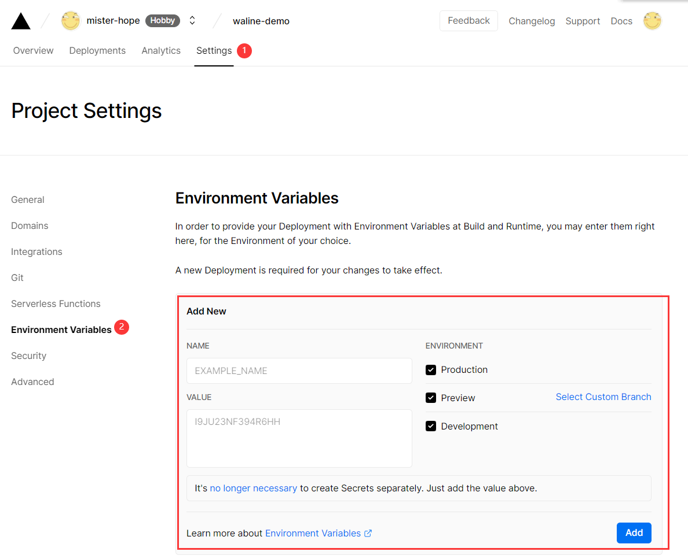

我们发布了 `@waline/vercel` 包作为服务端。Vercel 部署也是我们最推荐的方式。

<!-- more -->

## 如何部署

1. 点击上方按钮，跳转至 Vercel 进行 Server 端部署。

   ::: note

   如果你未登录的话，Vercel 会让你注册或登录，请使用 GitHub 账户进行快捷登录。

   :::

1. 输入一个你喜欢的 Vercel 项目名称并点击 `Create` 继续:

   

1. 此时 Vercel 会基于 Waline 模板帮助你新建并初始化仓库，仓库名为你之前输入的项目名。

   

   一两分钟后，满屏的烟花会庆祝你部署成功。此时点击 `Go to Dashboard` 可以跳转到应用的控制台。

   

1. 点击顶部的 `Settings` - `Environment Variables` 进入环境变量配置页，并配置三个环境变量 `LEAN_ID`, `LEAN_KEY` 和 `LEAN_MASTER_KEY` 。它们的值分别对应上一步在 LeanCloud 中获得的 `APP ID`, `APP KEY`, `Master Key`。

   

   ::: note

   如果你使用 LeanCloud 国内版，请额外配置 `LEAN_SERVER` 环境变量，值为你绑定好的域名。

   :::

1. 环境变量配置完成之后点击顶部的 `Deployments` 点击顶部最新的一次部署右侧的 `Redeploy` 按钮进行重新部署。该步骤是为了让刚才设置的环境变量生效。

   

1. 此时会跳转到 `Overview` 界面开始部署，等待片刻后 `STATUS` 会变成 `Ready`。此时请点击 `Visit` ，即可跳转到部署好的网站地址，此地址即为你的服务端地址。

   
